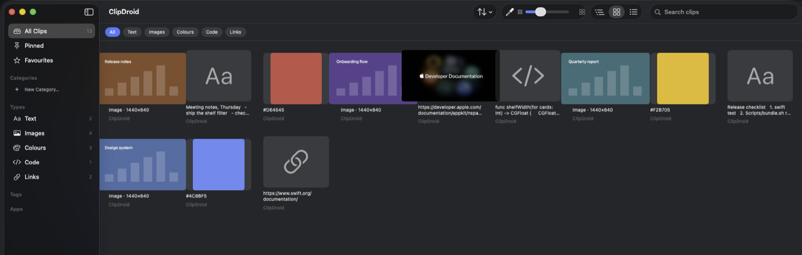
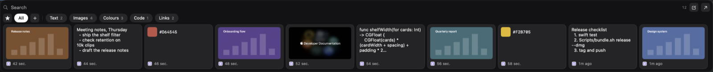

# ClipDroid

A native macOS clipboard and screenshot history manager. Everything you copy is kept, searchable
and reachable — from a shelf at the edge of the screen, a quick-paste window over whatever app
you're in, or a full library window.

Fully offline. No account, no sync, no analytics. The only network request it ever makes is
fetching a page title when you copy a link, and that is opt-in and off by default.

> **Status:** feature-complete through milestone M5; M6 (tools, intelligence, ship) in progress.
> Not yet notarized — see [Distribution](#distribution).



The shelf, expanded. It collapses to a slim bar at the screen edge until you point at it.



<sub>Screenshots use a synthetic clip history, not real clipboard contents.</sub>

---

## What it does

**Captures everything** — text, rich text, images, screenshots, files, colours, links and code, each
typed automatically and attributed to the app it came from. Images get thumbnails and Vision OCR, so
a screenshot is findable by the words inside it.

**Three ways to get it back**

| | |
|---|---|
| **Shelf** | A strip at the screen edge that collapses to a slim bar until you point at it. Click a card to paste, drag it into any app, or filter by collection and content type. |
| **Quick Paste** | `⌃⌘V` from anywhere. Type a few letters, press Return, and it lands in the field you were in — under three seconds, which is the design target. |
| **Library** | The full window: grid, timeline or list, faceted sidebar, full-text search, sorting, bulk actions. |

**Organises itself** — collections, tags, and smart filter rules that file clips as they arrive
("everything from Figma into Design Assets") and can be applied retroactively to thousands of
existing clips.

**Knows what not to keep** — sensitive content is detected in tiers rather than as a boolean.
Private keys, JWTs, API-key shapes and Luhn-valid card numbers are marked `secret`: blurred, kept
off the shelf, and eligible for auto-deletion. Email addresses and phone numbers are recorded as
`personal` but never blurred — a flat "sensitive/not" that fires on every email address blurs most
ordinary clips, turns the badge into noise, and gets the feature switched off.

**Tools** — pick a colour from anywhere on screen with `⌃⌘P`, or click any pixel of an image in the
preview; either way it is filed as a colour clip with its hex.

### Keyboard

| Key | |
|---|---|
| `⌃⌘V` | Quick Paste |
| `⌃⌘0`–`⌃⌘9` | Paste one of the ten most recent clips directly |
| `⌃⌘P` | Pick a colour from the screen |
| Arrows | Move between clips in the Library; hold `⇧` to select a run |
| `Space` / `Esc` | Open the preview / close it |
| `⌃Space` | Open the focused clip's menu |
| `⌘A`, `⌘-click`, `⇧-click` | Select all listed, toggle one, extend a range |
| `Delete` | Delete the selection, after confirming |

Search accepts filters: `dashboard @screenshot @today`, `@Figma`, `@favourite`.

---

## Requirements

- **macOS 26 (Tahoe) or later.** The minimum is set by `LSMinimumSystemVersion`; it will not launch
  on anything older.
- Swift 6.3 toolchain (Xcode 26) to build.

No third-party dependencies. SQLite comes from the system.

## Build and run

```bash
swift build
swift test
./Scripts/bundle.sh release      # assembles dist/ClipDroid.app and signs it
open dist/ClipDroid.app
```

SwiftPM only ever produces a bare executable — there is no `.xcodeproj`. `Scripts/bundle.sh`
assembles the `.app`, which is what gives it an icon, an `Info.plist` and a code signature.

**Always launch the bundle, never the raw binary.** TCC attributes a directly-exec'd binary to the
terminal as its responsible process, which fakes permission results in both directions and wastes
hours.

### Signing

`bundle.sh` prefers an **Apple Development** certificate and refuses to fall back to ad-hoc signing
silently. That refusal is deliberate: ad-hoc mints a new identity on every build, so every rebuild
revokes the app's Accessibility grant, and the resulting misbehaviour is indistinguishable from a
bug in the paste path.

If you have no Apple ID set up in Xcode, `Scripts/create-signing-identity.sh` makes a stable
self-signed identity. Note that a self-signed certificate has no Team ID, so TCC pins the grant to
the code hash and it is revoked on every rebuild anyway — an Apple Development certificate is worth
the five minutes.

To reset permissions while debugging:

```bash
tccutil reset Accessibility dev.philtronic.ClipRoid
```

---

## Architecture

Seven targets. The graph exists to keep one rule enforceable by the compiler:

> **`ClipRoidStore` and `ClipRoidPlatform` cannot import each other.** Nothing that touches a
> pasteboard may know a database exists, and nothing that touches the database may reach for AppKit.

`ClipRoidKit` is the only place both are visible, and that is what makes the entire capture pipeline
testable against a fake pasteboard and a temp-directory store.

```
ClipRoidApp (executable) ── @main only
      └─> ClipRoidUI ──────── SwiftUI views + @Observable view models
            └─> ClipRoidKit ── services, and the AppEnvironment composition root
                  ├─> ClipRoidStore    SQLite + blob storage
                  ├─> ClipRoidPlatform AppKit / Carbon / Vision adapters
                  ├─> ClipRoidImaging  CoreGraphics + ImageIO only
                  └─> ClipRoidCore     pure Foundation, zero platform imports
```

`ClipRoidCore` holds the value types and the pure logic that carries most of the test coverage —
classification, the sensitivity scanner, the search-query parser, dedupe, retention, grid
navigation — plus the capability protocols that `ClipRoidPlatform` implements and `ClipRoidKit`
composes.

### Persistence

Raw SQLite via `import SQLite3`, with an FTS5 external-content index. No ORM and no dependency: the
system SQLite has `ENABLE_FTS5`, and FTS5 is what keeps search interactive over 10,000+ clips.

Ranking is `bm25(clip_fts, 10.0, 3.0, 5.0)` — body 10, title 5, OCR text 3. OCR is weighted lowest
because it is noisy: a screenshot that happens to contain a word should not outrank a clip whose
actual content is that word. **`bm25()` returns negative scores where more negative is better**, so
plain ascending order is correct. This reads like a bug and is not one.

Blobs live on disk, sharded by UUID prefix; rows hold paths. Timestamps are integer milliseconds,
not ISO-8601 strings.

### Concurrency

Swift 6 language mode throughout.

| | |
|---|---|
| All `NSPasteboard` access, reads *and* writes | `@PasteboardActor`, a custom global actor |
| `ClipStore`, `BlobStore`, `EnrichmentPipeline` | `actor` |
| Hotkeys, paste delivery, view models | `@MainActor` |
| Everything in `ClipRoidCore` | `nonisolated` |

**Self-capture suppression is load-bearing.** When ClipDroid writes the pasteboard in order to
paste, the poller must not re-capture it. Three layers, because one is not enough: a change-count
handshake with no `await` between `clearContents()` and recording the count; a private origin UTI
carrying the source clip's UUID, so a write we own promotes the existing clip instead of duplicating
it; and the community transient conventions (`org.nspasteboard.TransientType`, `ConcealedType`,
`AutoGeneratedType`). A test drives write → tick → write → tick — the second write models the
optional "restore previous clipboard", which is the case a single guard misses — and asserts the
row count never moves.

---

## Testing

```bash
swift test     # 281 tests
```

Tests use swift-testing (`@Suite` / `@Test` / `#expect`). Store tests get a temp-directory database
each; UI tests get an isolated `UserDefaults` suite, so a test run never touches real preferences.

Two things this codebase has learned the hard way, both recorded here because the tests did not
catch them:

- **A passing test suite is not a working app.** Several real bugs — blank image tiles, a preview
  that closed in one second, cards that would not resize, a sort slider that did nothing — were
  found by running the app and taking screenshots, not by the suite. Milestone sign-off is a manual
  walkthrough of observable user actions, not a green run.
- **Test the control, not just the model.** The shelf-size slider was inert for the whole of its
  travel while two tests covering card sizing passed throughout, because both exercised the clamp
  over its own range rather than over the range the slider actually offered.

---

## Distribution

The app is **not notarized**, because notarization needs a Developer ID Application certificate and
therefore the paid Apple Developer Program. An Apple Development certificate signs it fine locally
but Gatekeeper rejects it anywhere else.

```bash
./Scripts/release.sh               # tests, then builds dist/ClipDroid-<version>.dmg
./Scripts/release.sh --notarize    # once you have a Developer ID certificate
```

`release.sh` refuses to build from uncommitted changes, because the build number is the commit
count. It runs the tests, then calls `bundle.sh release --dmg`. The version comes from the latest
git tag, so tag before building a release.

Someone you hand an un-notarized `.dmg` to will be told ClipDroid *"cannot be opened because Apple
cannot check it for malicious software."* On macOS 15 and later, Control-click → Open no longer gets
past that — they have to open **System Settings → Privacy & Security** and press **Open Anyway**
after the first refusal.

Expect to grant Accessibility again after switching to a Developer ID build: it is a different code
identity, so TCC treats it as a different app.

---

## Permissions

ClipDroid asks for nothing until a feature needs it.

| | Needed for |
|---|---|
| **Accessibility** | Auto-paste only — posting a synthetic `⌘V`. Without it, clips still reach the clipboard and you press `⌘V` yourself. |
| **Screen Recording** | Not required. The colour picker uses `NSColorSampler`, whose loupe runs out of process, so the app never reads the screen. |

Global hotkeys use Carbon's `RegisterEventHotKey`, which needs no permission at all.

Inline shortcut expansion (typing `;sig` to expand a clip) is built and tested but **switched off**
behind `FeatureFlags.inlineShortcuts`, because it requires a `CGEventTap` that observes typing.

---

## Layout

```
Sources/            the seven targets above
Tests/              one suite per target
Scripts/bundle.sh   assembles, signs, and optionally notarizes and packages the .app
Scripts/release.sh  tests, then builds a release .dmg via bundle.sh
Docs/spikes.md      findings from the four de-risking spikes, with the evidence
spec.md             the original product specification
```

Storage lives at `~/Library/Application Support/ClipRoid/` and the bundle identifier is
`dev.philtronic.ClipRoid` — both still spelled the old way on purpose. TCC keys the Accessibility
grant on the identifier and `UserDefaults` keys every preference on it, and the support directory
holds every clip a user has; renaming either to match the product would silently reset permissions
and orphan the entire history.
